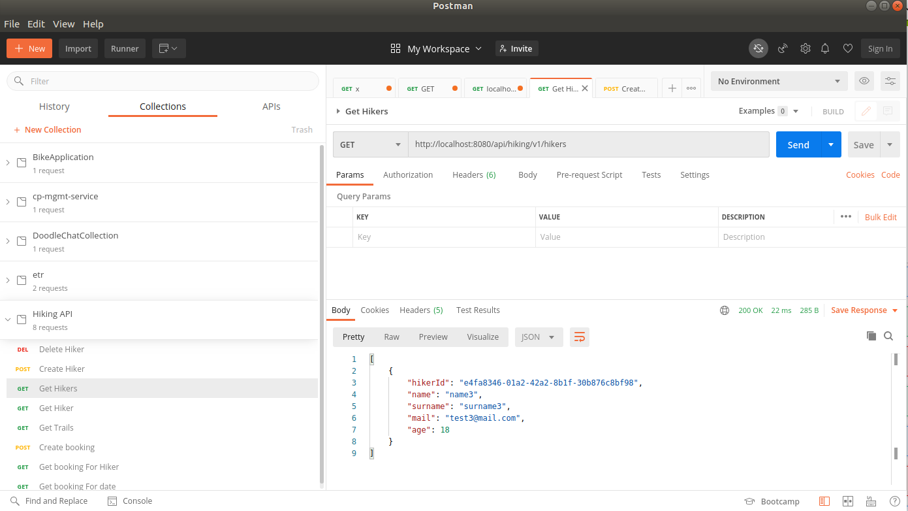
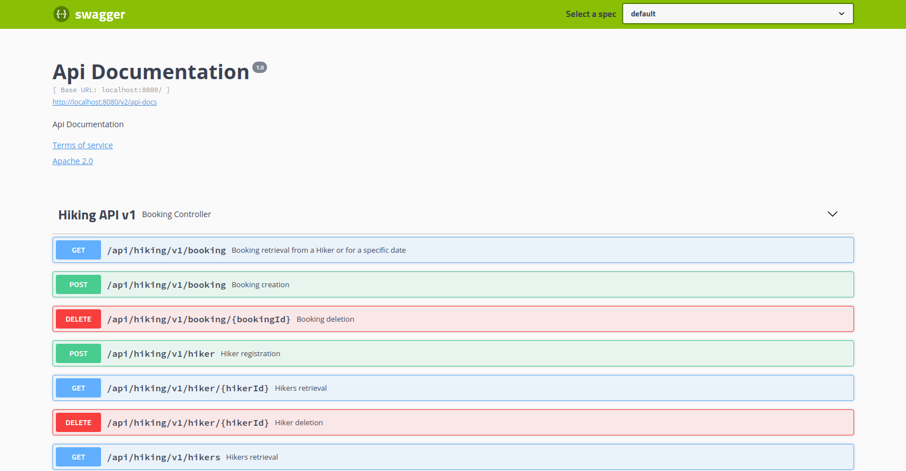

<h2>INFO</h2>

The app was developed using **IntelliJ 2018 3.5**

Spring Boot version: **5.1.6**

PostgreSQL version: **12.3**

docker-compose version: **1.25.5**

Docker compose will generate 2 containers: the first with the PostgreSQL DB containing the tables and the trail data and
the second with the spring-boot backend solution.
The test cases will generate (and delete, once tests are finished) sample hiker data to test the endpoint operations.

A Postman colleciton is available to test-out application functionalities

The API implements also swagger documentation

<h2>COMMANDS</h2>

Start docker Hiking API containers (must be in project working directory):
**docker-compose -f .\docker-compose.yml up**

Remove containers for instance (in case reset is needed):
**docker-compose rm ${docker ps -a}**

<h2>SWAGGER ENDPOINT DOCUMENTATION</h2>
Swagger documentation is accessible at the following URL once the containers are started:

**http://localhost:8080/swagger-ui.html#/Hiking_API_v1**
